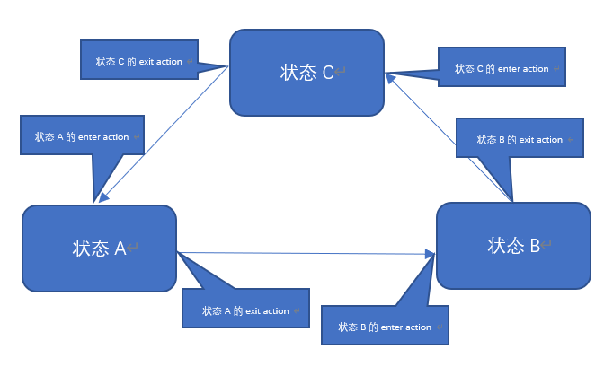

有限状态机是我们游戏程序中非常常用的一种设计模式。不止游戏，在AI和编译器程序方面很出名。  

## [什么是有限状态机?](https://zh.wikipedia.org/wiki/%E6%9C%89%E9%99%90%E7%8A%B6%E6%80%81%E6%9C%BA)

有限状态机是表示有限个状态以及在这些状态之间的过渡和动作等行为的数学计算模型[^1]。(数学计算模型这个词要是觉得难理解，在脑海中换成结构即可。)  

### 有限状态机的元素

a.状态（status）  
b.进入动作（entry action）:在进入状态时进行  
c.退出动作（exit action）：在退出状态时进行  
d.过渡动作（transition action）在进行特定过渡时进行  



### 写一个简单版本的有限状态机的例子

``` cs
public class FSMMachine<T>
{
  private string fsmName;
  private bool running = false;
  Dictionary<T,StateBehaviour> stateBehaviourDic = new Dictionary<T, StateBehaviour>();
  public T DefaultState{get; set;} = default(T);
  private T currentState;
  public T CurrentState
  {
    get
    {
      return currentState;
    } 
    set
    {
      ChangeStatus(value);
    }
  }

  //构造函数中添加默认状态
  public FSMMachine(string fsmName)
  {
    this.fsmName = fsmName;
  }

  //添加状态
  public void AddStatus(T state,StateBehaviour stateBehaviour)
  {
    stateBehaviourDic[state] = stateBehaviour;
  }

  //移除状态
  public void RemoveStatus(T state)
  {
    if(!stateBehaviourDic.ContainsKey(state))
      return;

    stateBehaviourDic.Remove(state);
  }

  //改变状态
  public void ChangeStatus(T state)
  {
    if(!stateBehaviourDic.ContainsKey(state)||stateBehaviourDic[state] == null)
      throw new InvalidOperationException(string.Format("[FSM {0}] : Can't call 'ChangeStatus' before the stateBehaviour of state has been settled.",fsmName));

    stateBehaviourDic[currentState].OnLeave();
    stateBehaviourDic[state].OnEnter();
    currentState = state;
  }

  public void Run()
  {

    if(!stateBehaviourDic.ContainsKey(DefaultState)||stateBehaviourDic[DefaultState] == null)
      throw new InvalidOperationException(string.Format("[FSM {0}] : Can't call 'ChangeStatus' before the stateBehaviour of state has been settled.",fsmName));

    stateBehaviourDic[DefaultState].OnEnter();
    currentState = DefaultState;
    running = true;
  }

  public void Stop()
  {

    if(!stateBehaviourDic.ContainsKey(currentState)||stateBehaviourDic[currentState] == null)
      throw new InvalidOperationException(string.Format("[FSM {0}] : Can't call 'ChangeStatus' before the stateBehaviour of state has been settled.",fsmName));

    stateBehaviourDic[currentState].OnLeave();
    running = false;
  }
}
public class StateBehaviour 
{
  public virtual void OnEnter()
  {
  }

  public virtual void OnLeave()
  {
  }
}
//例子:
public enum StateExample
{
  LightOffOn,
  LightColorSwitch
}
public class FSMExample : MonoBehaviour 
{
  FSMMachine<StateExample> fSMMachine;
  // Use this for initialization
  void Start () {

    fSMMachine = new FSMMachine<StateExample>("Example");
    fSMMachine.DefaultState =  StateExample.LightOffOn;
    fSMMachine.AddStatus(StateExample.LightOffOn, new LightingSwitchOffState());
    fSMMachine.AddStatus(StateExample.LightColorSwitch, new LightingColorChangeState(Color.red));

    fSMMachine.Run();

    StartCoroutine(ChangeState());
  }

  IEnumerator ChangeState()
  {
    yield return new WaitForSeconds(2f);
    fSMMachine.CurrentState = StateExample.LightColorSwitch;
  }
}
public class LightingColorChangeState : StateBehaviour {

	private Color targetColor;
	private Color oriColor;
	private Light light;
	public LightingColorChangeState(Color TargetColor)
	{
		targetColor = TargetColor;
	}

	public override void OnEnter()
	{
		base.OnEnter();
		light = GameObject.FindObjectOfType<Light>();
		oriColor = light.color;//记录原来的颜色
		light.color = targetColor;
	}

	public override void OnLeave()
	{
		base.OnEnter();
		light.color = targetColor;//恢复颜色
	}
}
public class LightingSwitchOffState : StateBehaviour {

	private Light light;
	public override void OnEnter()
	{
		base.OnEnter();
		light = GameObject.FindObjectOfType<Light>();
		light.enabled = false;
	}

	public override void OnLeave()
	{
		base.OnEnter();
		light.enabled = true;
	}
}
```
这个简单版本的有限状态机，已经基本完成了。而且可以满足很多状况下的需求了。
但是，对有一定经验的程序员来说，这是远远不够的。因为，例子中的FSM是没有把**转换(Transition)这个概念给抽象出来**的。
这样，我们的转换方向是任意的，且转换的条件永远是以来一个参数的不同值，这个值就是CurrentState。

状态机除了基础的有限状态机，还有层次状态机和下推状态机。（游戏编程模式这本书里有介绍，有作者自己维护的网页版和中国人翻译的网页版）

下一篇，我们会实现一个更加完整，扩展性更高的FSM。  
[有限状态机(finite-state machine)(二)](https://potrochen.github.io/post/2020/01/12/FSM_1.html) 


Github仓库网址：  
[https://github.com/PotroChen/FSM-Unity3d](https://github.com/PotroChen/FSM-Unity3d)  

参考：  
[有限状态机wiki百科](https://zh.wikipedia.org/wiki/%E6%9C%89%E9%99%90%E7%8A%B6%E6%80%81%E6%9C%BA)  
[游戏编程模式](https://gpp.tkchu.me/state.html)

[^1]: 数学计算模型:这个词听上去好像学术，会让人感觉很难其实并没有。  简单来讲，数学计算模型是一种用于描述某种结构的具体组织方式的东西。只要这种结构能根据一组输入值，得到输出值。所以，这个听上去很高大上很学术的词，本身就是一个抽象的词用于描述一类东西的，我们不用太在意的。

